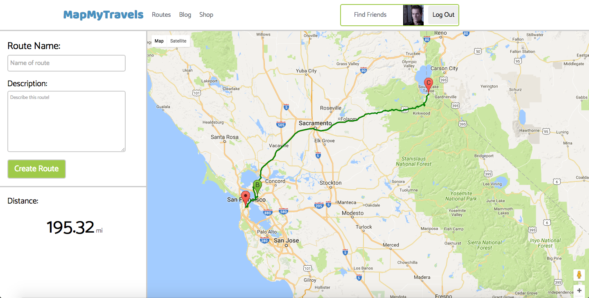

# MapMyTravels

[MapMyTravels Live][heroku]

[heroku]: www.mapmytravels.org

MapMyTravels is a full-stack web application inspired by MapMyRun. It utilizes Ruby on Rails on the backend, a PostgreSQL database, and React.js with a Redux architectural framework on the frontend.

## Features & Implementation

### Route Creation and Storage

MapMyTravels uses Google Maps API to create traveling routes and connecting multiple coordinates that the user creates through clicking on the map. The map can then be saved via Google Static Maps API, and with all the coordinates that are stored on PostgreSQL, users can access their created route upon request.

