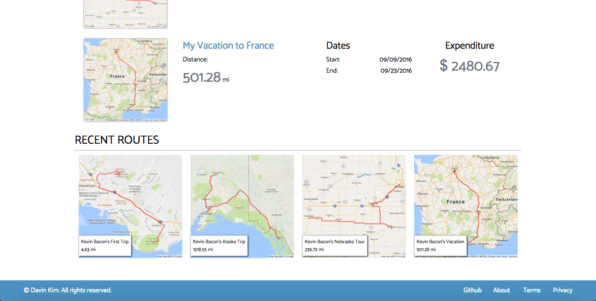

# MapMyTravels

[MapMyTravels Live][heroku]

[heroku]: www.mapmytravels.org

MapMyTravels is a full-stack web application inspired by MapMyRun. It utilizes Ruby on Rails on the backend, a PostgreSQL database, and React.js with a Redux architectural framework on the frontend.

## Features & Implementation

### Route Creation and Storage

MapMyTravels allows users to create traveling routes and connecting multiple coordinates that the user creates through clicking on the map. The map data can then be saved on PostgreSQL, and users can access their created route upon request.


Maps rendering and path rendering was implemented using the Google Maps API.



### Single-Page App

MapMyTravels is a single-page application, with all the routers set up to render different React components upon different requests. The root static page keeps track of authentication and only allows users to have access to the core functionalities of the application upon valid sign-up/log-in.

```javascript
<Router history={ hashHistory }>
  <Route path="/" component={ App }>
    <Route path="/login" component={ SessionFormContainer } onEnter={this._redirectIfLoggedIn}/>
    <Route path="/signup" component={ SessionFormContainer } onEnter={this._redirectIfLoggedIn}/>
    <Route path="/dashboard" component={ DashboardContainer } onEnter={this._ensureLoggedIn} />
    <Route path="/create_route" component={ CreateRouteFormContainer } onEnter={this._ensureLoggedIn} />
    <Route path="route/:routeId" component={ RouteDetailContainer } onEnter={this._getAllRoutes} />
    <Route path="log_trip" component={ LogTripFormContainer } onEnter={this._ensureLoggedIn} />
    <Route path="trip/:tripId" component={ TripDetailContainer } onEnter={this._getAllTrips} />
    <Route path="/friends" component={ FriendsContainer } onEnter={this._getFriends} />
    <Route path="/find_friends" component={ FindFriendsContainer } onEnter={this._getFriendsAndOtherUsers} />
    <Route path="/create_goal" component={ CreateGoalFormContainer } onEnter={this._ensureLoggedIn} />
    <Route path="/feed" component={ ActivityFeedContainer } onEnter={this._getFriendsAndFeedTrips} />
    <Route path="/profile" component={ ProfileContainer } onEnter={this._ensureLoggedIn} />
  </Route>
</Router>
```
