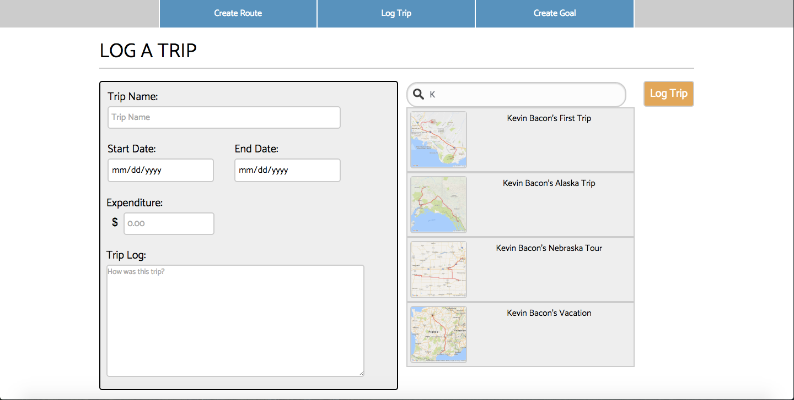
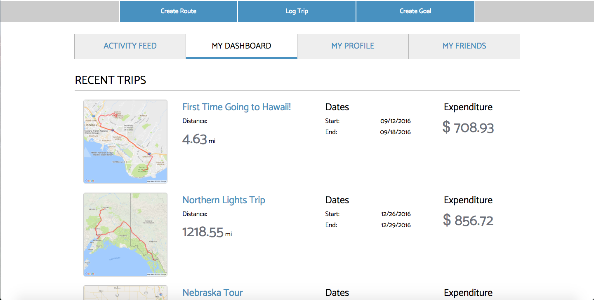
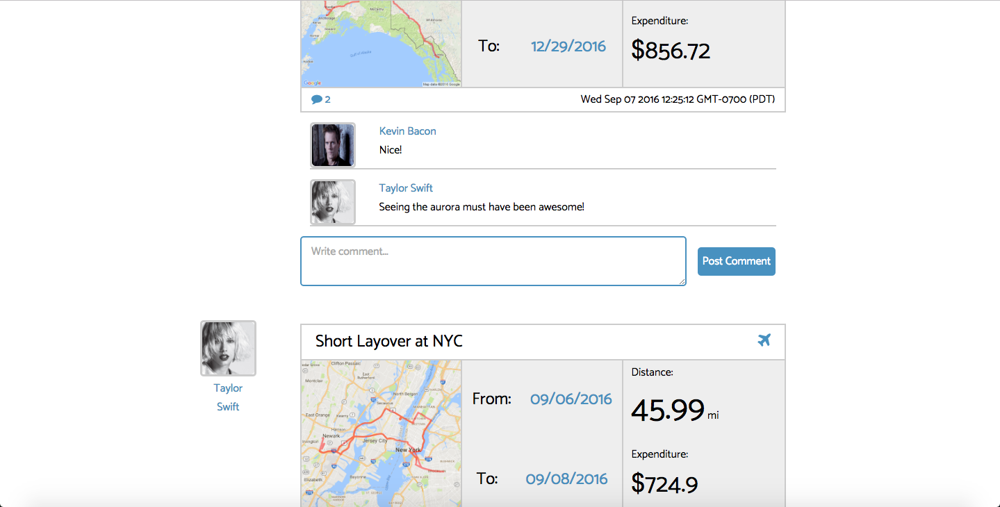

# MapMyTravels

[MapMyTravels Live][heroku]

[heroku]: www.mapmytravels.org

MapMyTravels is a full-stack web application inspired by the MapMyRun app. It utilizes Ruby on Rails on the backend, a PostgreSQL database, and React.js with a Redux architectural framework on the frontend.

## Features & Implementation

### Route Creation and Storage

MapMyTravels allows users to create traveling routes and connecting multiple coordinates that the user creates through clicking on the map. The map data can then be saved on PostgreSQL, and users can access their created route upon request.


Maps rendering and path rendering was implemented using the Google Maps API.


Map images were rendered using the coordinates that were saved on the backend as well as the Google Static Maps API.

### Single-Page App

MapMyTravels is a single-page application, with all the routers set up to render different React components upon different requests. The root static page keeps track of authentication and only allows users to have access to the core functionalities of the application upon valid sign-up/log-in.

```javascript
<Router history={ hashHistory }>
  <Route path="/" component={ App }>
    <Route path="/login" component={ SessionFormContainer } onEnter={this._redirectIfLoggedIn}/>
    <Route path="/signup" component={ SessionFormContainer } onEnter={this._redirectIfLoggedIn}/>
    <Route path="/dashboard" component={ DashboardContainer } onEnter={this._ensureLoggedIn} />
    <Route path="/create_route" component={ CreateRouteFormContainer } onEnter={this._ensureLoggedIn} />
    <Route path="route/:routeId" component={ RouteDetailContainer } onEnter={this._getAllRoutes} />
    <Route path="log_trip" component={ LogTripFormContainer } onEnter={this._ensureLoggedIn} />
    <Route path="trip/:tripId" component={ TripDetailContainer } onEnter={this._getAllTrips} />
    <Route path="/friends" component={ FriendsContainer } onEnter={this._getFriends} />
    <Route path="/find_friends" component={ FindFriendsContainer } onEnter={this._getFriendsAndOtherUsers} />
    <Route path="/create_goal" component={ CreateGoalFormContainer } onEnter={this._ensureLoggedIn} />
    <Route path="/feed" component={ ActivityFeedContainer } onEnter={this._getFriendsAndFeedTrips} />
    <Route path="/profile" component={ ProfileContainer } onEnter={this._ensureLoggedIn} />
  </Route>
</Router>
```

### Dashboard

MapMyTravels also keeps track of trips that the users have gone on and logged. It includes statistics such as dates travelled and expenditure. This allows the user to have a running history of places they've been to and keep track of certain statistics during their trips.



Users can log trips using routes that they created earlier.



The dashboard keeps track of all the user's trips.

# Social Media

MapMyTravels is also a social application, where users can choose to follow/friend other users and share trips with each other on their respective activity feeds. A commenting feature has also been included that allows users to interact with each other even further.



## Future Directions for the Project

In addition to the features already implemented, I plan to continue work on this project. The next steps for MapMyTravels are outlined below.

### Photo Album

Sharing trips with each other can be further encouraged by allowing users to post photos from their trips and sharing them with their friends.

### Calendar

A calendar on the dashboard that marks the dates that the user travelled will give a more visual representation of the user's travelling history.
